# Art Institution Digital Platform

### A full-stack management system for a multi-department art institution — galleries, exhibitions, events, commerce, artist relations, and internship programs, unified in one platform.


---

> [!NOTE]
> This repository is a public case study of my work on the platform. It does **not** contain the application's proprietary source code, credentials, private user data, or other confidential information belonging to Peterfleming Arts Limited.
---

## Table of Contents

 1. [Project Overview](#project-overview)
 2. [My Role](#my-role)
 3. [Platform Architecture](#platform-architecture)
 4. [Core Platform Areas](#core-platform-areas)
 5. [Administrative Portal](#administrative-portal)
 6. [Authentication, Authorization & Access Control](#authentication-authorization--access-control)
 7. [Business Logic & Service Layer](#business-logic--service-layer)
 8. [Domain Model](#domain-model)
 9. [Notifications](#notifications)
10. [Media & File Management](#media--file-management)
11. [Document & PDF Generation](#document--pdf-generation)
12. [Automated Maintenance](#automated-maintenance)
13. [Deployment & CI/CD](#deployment--cicd)
14. [Security Considerations](#security-considerations)
15. [Third-Party Integrations](#third-party-integrations)
16. [Technology Stack](#technology-stack)
17. [Notable Laravel Architecture](#notable-laravel-architecture)
18. [Resource-Oriented Admin Architecture](#resource-oriented-admin-architecture)
19. [AI Playground](#ai-playground)
20. [Platform Structure](#platform-structure)
21. [Engineering Highlights](#engineering-highlights)
22. [Project Screenshots](#project-screenshots)
23. [Recommended Technical Diagrams](#recommended-technical-diagrams)
24. [Engineering Philosophy](#engineering-philosophy)
25. [What This Project Demonstrates](#what-this-project-demonstrates)
26. [Confidentiality & Portfolio Disclaimer](#confidentiality--portfolio-disclaimer)
27. [Public Repository Safety Checklist](#public-repository-safety-checklist)
28. [Project Information](#project-information)

---

## Project Overview

**Peterfleming Arts Limited** is an art institution with multiple interconnected areas of operation, including:

| Area | Description |
| --- | --- |
| Gallery & Exhibitions | Public artist and artwork showcasing |
| Artist Management | Structured artist records and relationships |
| Art Events & Registrations | Ticketed events with check-in |
| Art Supply Retail | Store inventory and point-of-sale |
| Studio & Creative Production | Creative operations and offerings |
| Interior Decoration Artworks | Dedicated interior-art catalog |
| Courses, Workshops & Training | Educational program management |
| Internship & Participant Programs | End-to-end applicant-to-alumni lifecycle |
| Framing & Stretcher Production | Production support |
| Space & Room Rentals | Bookable institutional spaces |
| Inventory & Operational Resources | Non-retail asset tracking |
| Online Art & Art-Supply Commerce | Digital sales workflows |

The platform was designed and developed to bring these activities into a **single digital ecosystem**, replacing fragmented administrative workflows with structured, role-based, and largely automated processes.

Rather than functioning as a conventional website, the application operates as a **business management platform with public-facing digital experiences and authenticated operational portals**.

### Project Goals

- Centralize institutional data and operations
- Provide structured management tools for administrators
- Give artists, participants, customers, and event attendees appropriate digital experiences
- Automate repetitive administrative processes
- Improve event registration and attendance tracking
- Digitize participant and internship management
- Support art and art-supply sales
- Improve artwork discoverability through QR-enabled physical artwork labels
- Provide reliable notifications and document generation
- Enforce role-based access to sensitive administrative functionality
- Create an architecture that can support additional institutional services over time

---

## My Role

**Role:** Software Engineer / Lead Developer

I was responsible for the design, development, integration, deployment, and ongoing technical management of the platform.

| Category | Responsibilities |
| --- | --- |
| Architecture & Data | Application architecture, database design |
| Backend Development | Laravel backend development, business logic, service-layer design |
| Frontend | Frontend implementation |
| Access Control | Authentication, authorization, role and permission enforcement |
| Feature Development | CRUD/resource management, event and registration workflows, ticket and QR-code generation, PDF generation |
| Communications | Email notification systems |
| Infrastructure | Cloud media storage, CI/CD deployment, shared-hosting deployment configuration, database migrations |
| Operations | Scheduled/automated cleanup processes, production maintenance |
| Engineering Practice | Security-conscious application design, third-party service integration |
| Innovation | Early-stage AI-assisted creative tooling |


---

## Platform Architecture

The platform combines a public-facing website with authenticated administrative and participant experiences.

### High-Level Architecture

<p align="center">
  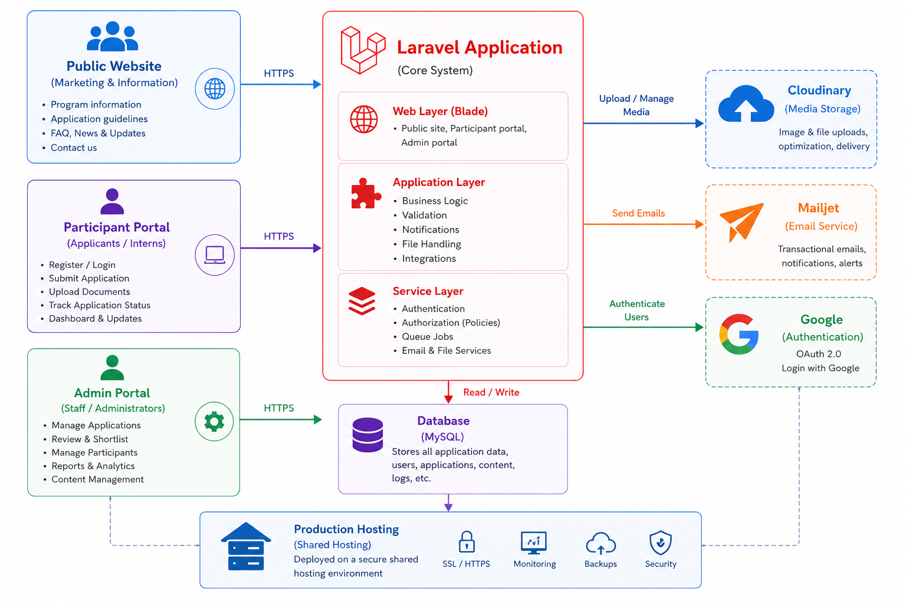
</p>

---

## Core Platform Areas

### 1. Public-Facing Digital Experience

The platform provides multiple public-facing sections representing the institution's different activities.

#### Gallery

The gallery experience provides access to:

- Artist profiles
- Artwork collections
- Exhibitions
- Events
- Related cultural and artistic content
- Online Store

The gallery is implemented as a distinct subdomain experience while remaining accessible through the primary website.

<p align="center">
  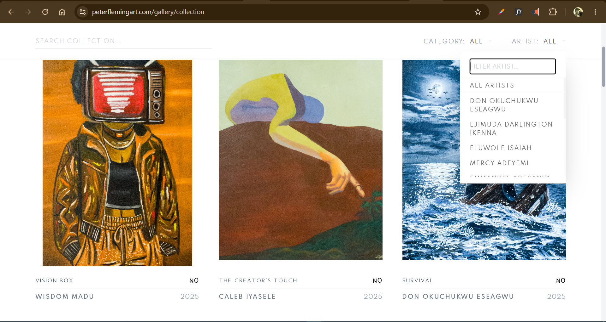
  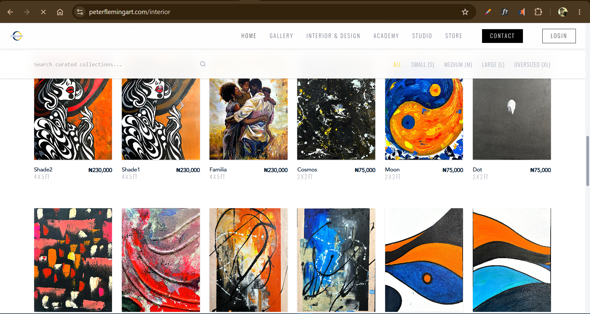
</p>

---

### 2. Artist Management

Administrators can create and manage detailed artist records.

Artist information can include:

- Artist identity
- Biography/profile information
- Artist statement
- Related artworks
- Exhibition relationships
- Other institutional information

The artist management workflow is designed to provide a structured institutional record rather than simply storing a name and photograph.

<p align="center">
  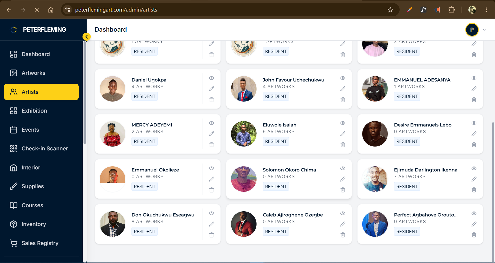
  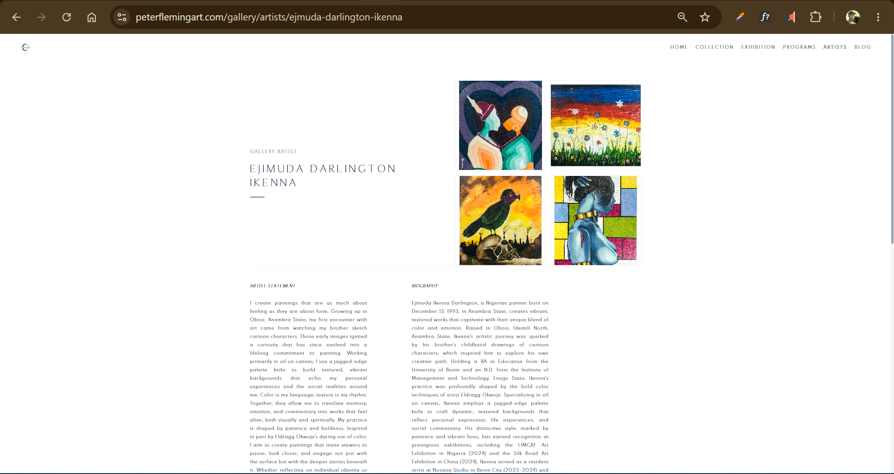
</p>

---

### 3. Artwork Management

The artwork module provides structured management of artworks throughout the institution.

Artwork records can contain:

- Artwork images
- Title and descriptive information
- Artist relationship
- Artwork metadata
- Pricing
- Other relevant details

Administrators can manage artworks through dedicated resource interfaces including:

- Listing/index pages
- Creation forms
- Editing forms
- Detail/show pages

#### QR Artwork Labels

One of the platform's specialized features is automated artwork-label generation.

Administrators can select artworks and generate printable PDF labels containing QR codes. A collector or visitor can scan the QR code placed beside a physical artwork and access the corresponding artwork information online.

```text
Artwork Selected
      ↓
Artwork Information Retrieved
      ↓
QR Code Generated
      ↓
Artwork Label Generated
      ↓
Printable PDF
      ↓
Physical Label Beside Artwork
      ↓
Collector Scans QR Code
      ↓
Artwork Information Online
```

<p align="center">
  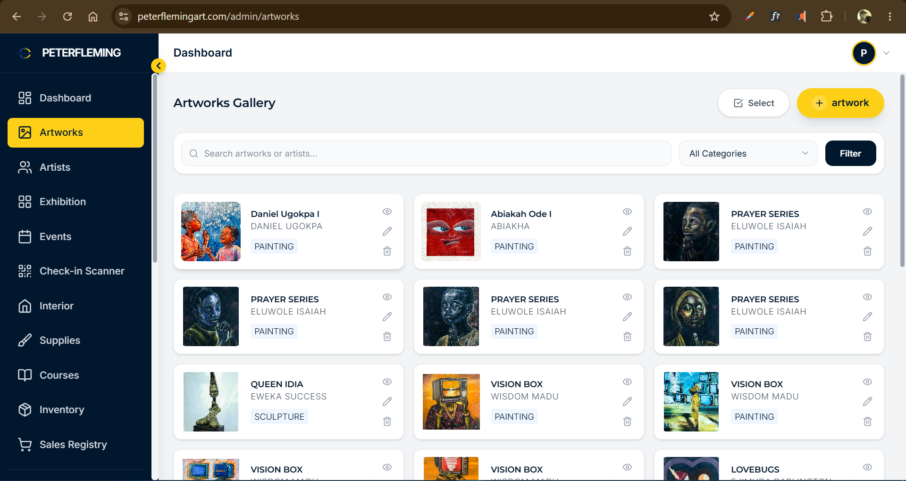
  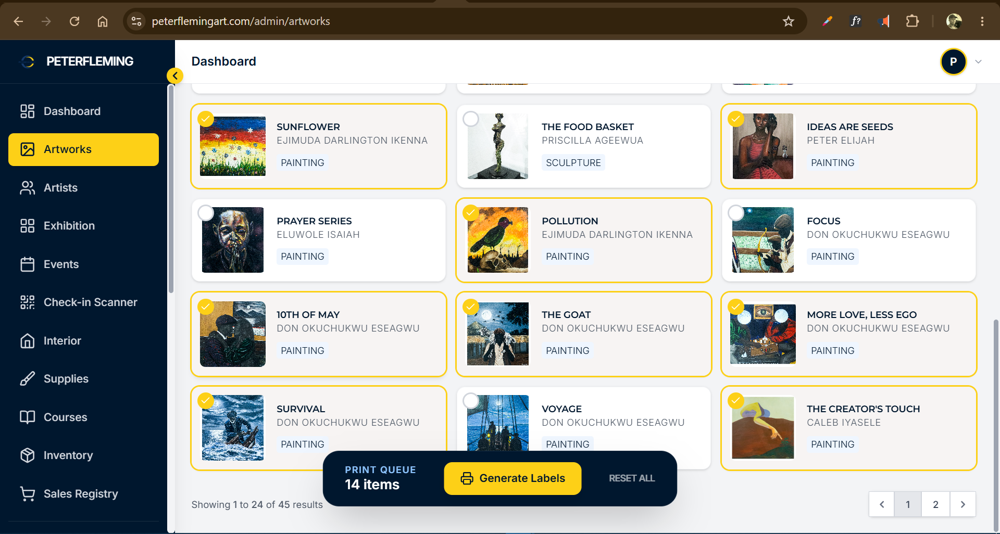
  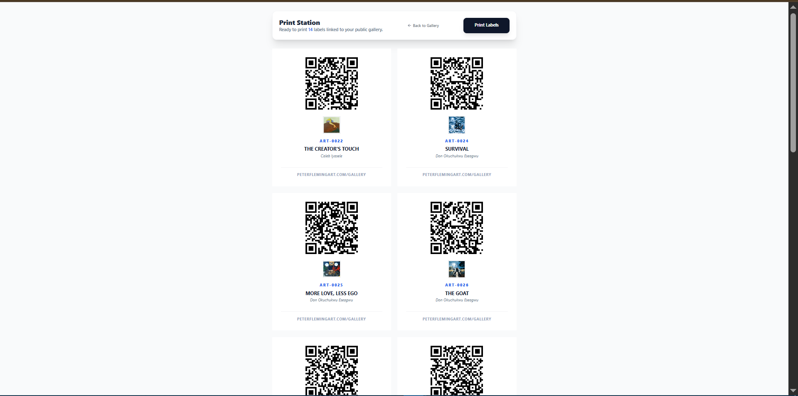
  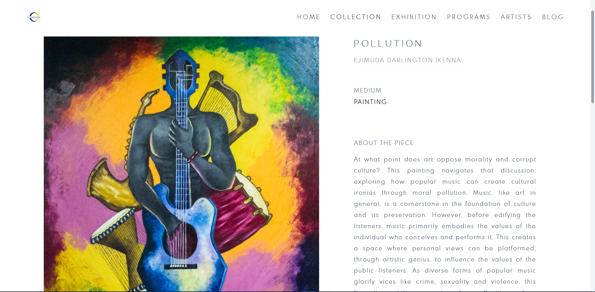
</p>

---

### 4. Exhibition Management

The exhibition module manages exhibitions and their relationship with events.

An exhibition can include information such as:

- Exhibition title
- Exhibition imagery
- Exhibition details
- Curator
- Subtitle and supporting metadata
- Related event information

#### Exhibition/Event Relationship

A key architectural decision was to treat exhibitions as a specialized form of event.

> **All exhibitions are events, but not all events are exhibitions.**

This relationship is managed through an **Exhibition Event Service**.

When an administrator creates an event whose type is `exhibition`, the platform can expose it through the exhibition experience while retaining the event functionality required for registration and attendance.

```text
                    EVENT
                      │
          ┌───────────┴───────────┐
          │                       │
     Regular Event           Exhibition
          │                       │
          │                 Exhibition Data
          │                       │
          └───────────┬───────────┘
                      ▼
              Public Experience
                      +
             Registration / Event
                Functionality
```

---

### 5. Event Management & Registration

Administrators can create and manage events from the administrative portal.

Events can support:

- Event details
- Event type
- Venue
- Start/end dates
- Registration configuration
- Capacity
- Registration deadlines
- Featured imagery
- Exhibition-specific information where applicable

Users can register for events.

#### Automated Ticketing

After successful event registration:

1. Registration is recorded
2. A ticket is generated
3. A unique ticket/QR payload is created
4. The ticket is delivered to the participant's email
5. The QR code can later be scanned during event check-in

```text
User
  │
  ▼
Event Page
  │
  ▼
Registration
  │
  ▼
Registration Record
  │
  ▼
Ticket Generation
  │
  ├──────────────► QR Code
  │
  └──────────────► Ticket Document
                         │
                         ▼
                    Email Delivery
                         │
                         ▼
                    Event Attendee
```

<p align="center">
  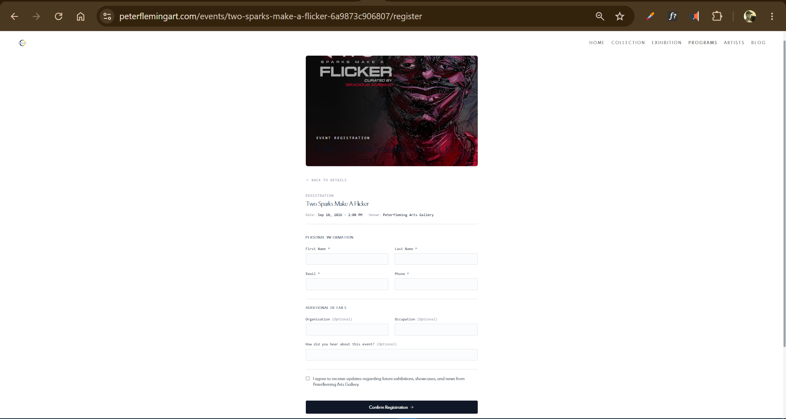
  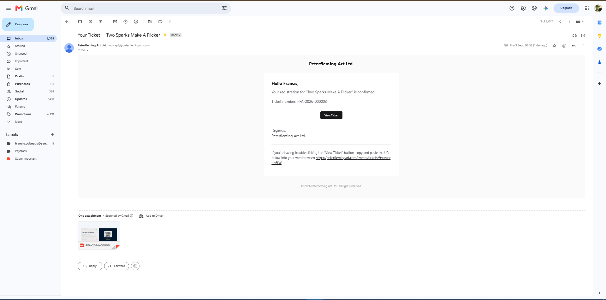
  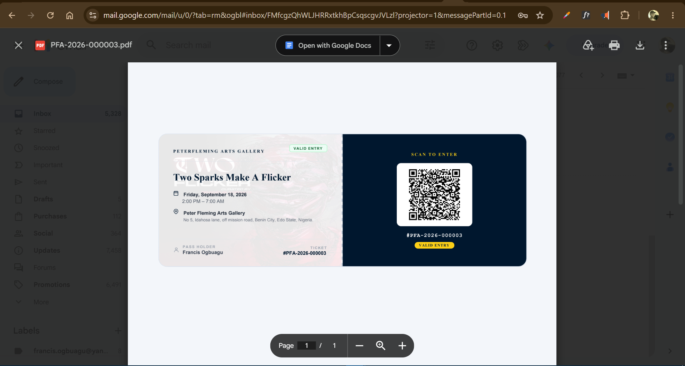
</p>

---

### 6. Event Check-In

The platform includes an administrative QR-code check-in scanner.

At an event venue, an authorized administrator can use a mobile device or compatible device to scan an attendee's ticket. The system verifies the ticket and records the check-in.

```text
Attendee Ticket
      ↓
QR Code Scan
      ↓
Ticket Verification
      ↓
Registration Lookup
      ↓
Check-In Record
      ↓
Attendee Marked Present
```

> **\[SCREENSHOT PLACEHOLDER — Mobile Check-In Scanner\]**

> **\[DIAGRAM PLACEHOLDER — Ticket Verification & Check-In Flow\]**

---

### 7. Event Flyer Generation

The platform also supports event flyer generation.

Flyer templates are managed by the system, allowing an event to be associated with an appropriate flyer design. Generated flyers can be associated with event registrations where applicable. Temporary generated flyer assets are subject to automated cleanup.

---

### 8. Programs & Participant Management

The platform provides a structured system for managing institutional programs such as:

- Internships
- Apprenticeships
- Student programs
- Training programs
- Other future participant-based programs

The architecture separates a **Program** from its **Intakes**.

```text
Program
  │
  ├── Internship Program
  │
  └── Intakes
       ├── January Intake
       ├── June Intake
       └── October Intake
```

This allows the institution to create a program once and manage multiple enrollment periods independently.

> **\[DIAGRAM PLACEHOLDER — Program → Intake → Application → Participant Lifecycle\]**

---

### 9. Applications

Applicants can apply for available programs.

The application system supports:

- Applicant information
- Program selection
- Intake selection
- Application records
- Supporting documents
- CV/resume submission
- Application review
- Acceptance/rejection workflows

Administrators can review applications and make decisions directly from the admin portal.

#### Application Lifecycle

```text
Applicant
   ↓
Application
   ↓
Document Submission
   ↓
Administrative Review
   ↓
┌───────────────┬───────────────┐
│               │               │
▼               ▼               │
Accepted      Rejected          │
│                               │
▼                               │
Participant Onboarding           │
│                               │
▼                               │
Participant Record              │
```

> **\[DIAGRAM PLACEHOLDER — Application Lifecycle\]**

---

### 10. Participant Portal

Once an application is accepted, the onboarding process converts the applicant into an active participant within the relevant program.

The participant portal provides a digital workspace for program participants. For the current implementation, this is primarily used for internship participants.

Participants can access functionality such as:

- Assignments
- Task-related activities
- Attendance
- Reports
- Program information
- Other participant-specific activities

---

### 11. Assignments & Evaluation

Administrators can create assignments for participants and manage their progress.

The system supports workflows around:

- Assignment creation
- Assignment submission
- Assignment review
- Grading/evaluation
- Participant notifications

This creates a digital feedback loop between administrators and participants.

> **\[SCREENSHOT PLACEHOLDER — Participant Assignment Dashboard\]**

> **\[SCREENSHOT PLACEHOLDER — Admin Assignment Management\]**

---

### 12. Attendance & Reports

Participant attendance can be digitally recorded.

The platform also supports reporting workflows such as:

- Daily registers
- Weekly participant reports
- General reports
- Other program-related records

The goal is to replace fragmented paper-based processes with structured digital records.

> **\[SCREENSHOT PLACEHOLDER — Attendance Management\]**

> **\[SCREENSHOT PLACEHOLDER — Participant Reports\]**

---

### 13. Certificates

Administrators can issue certificates to participants through the platform.

The certificate workflow is connected to participant records and can trigger notifications to the recipient.

> **\[SCREENSHOT PLACEHOLDER — Certificate Generation / Issuance Interface\]**

> **\[SCREENSHOT PLACEHOLDER — Example Certificate Preview\]**

---

### 14. Art Supply Store & Sales Management

The platform includes management functionality for the institution's art-supply store.

**Supply Management** — administrators can maintain records of supplies and products, including:

- Product information
- Quantity
- Pricing
- Stock availability
- Low-stock status

**Sales Registry** — sales can be recorded digitally. A sale can include:

- Items
- Quantities
- Unit prices
- Discounts
- Payment method
- Seller/admin
- Sale totals
- Sale items

The system provides a structured record of transactions and supports stock awareness.

> **\[SCREENSHOT PLACEHOLDER — Store Dashboard\]**

> **\[SCREENSHOT PLACEHOLDER — Inventory / Supplies Management\]**

> **\[SCREENSHOT PLACEHOLDER — Sales Registry\]**

> **\[DIAGRAM PLACEHOLDER — Sales → Stock Update Flow\]**

---

### 15. Inventory Management

Beyond retail supplies, the institution maintains operational inventory such as:

- Chairs
- Tables
- Equipment
- Tools
- Other institutional resources

The inventory module provides a centralized record for these resources.

---

### 16. Interior Art

The institution produces artworks intended for interior decoration.

The platform includes a dedicated interior-art section where these works can be managed and presented. Records can include:

- Artwork imagery
- Descriptions
- Pricing
- Other relevant metadata

> **\[SCREENSHOT PLACEHOLDER — Interior Art Gallery\]**

> **\[SCREENSHOT PLACEHOLDER — Interior Artwork Details\]**

---

### 17. Studio & Creative Operations

The studio represents the institution's creative production environment.

The platform supports presentation and management of studio-related offerings, including creative work, courses, and available spaces. The institution also provides rooms/spaces that can be made available for booking or rental.

> **\[SCREENSHOT PLACEHOLDER — Studio Page\]**

> **\[SCREENSHOT PLACEHOLDER — Available Rooms / Spaces\]**

---

### 18. Courses, Workshops & Training

The platform includes course management for educational and creative programs.

Administrators can create and manage courses and associate them with relevant institutional activities and programs, providing a foundation for art classes, workshops, training, and future learning experiences.

---

## Administrative Portal

The administrative portal is the operational core of the platform. It provides centralized management for:

Artists · Artworks · Exhibitions · Events · Programs · Intakes · Applications · Participants · Assignments · Attendance · Evaluations · Certificates · Courses · Interior artworks · Store supplies · Inventory · Sales · Users · Contacts · Other institutional records

Most management resources follow consistent CRUD patterns:

```text
Index / List
     │
     ├── Create
     │
     ├── View
     │
     ├── Edit
     │
     └── Delete / Archive where applicable
```

> **\[SCREENSHOT PLACEHOLDER — Admin Dashboard Overview\]**

> **\[SCREENSHOT PLACEHOLDER — Admin Navigation / Resource Management\]**

### Administrative Dashboard

The dashboard provides a high-level summary of important activity across the platform. It acts as an operational overview rather than requiring administrators to inspect each resource individually.

> **\[SCREENSHOT PLACEHOLDER — Full Admin Dashboard\]**

---

## Authentication, Authorization & Access Control

The platform separates normal users from administrative users through distinct authentication guards.

```text
                    Application
                         │
              ┌──────────┴──────────┐
              │                     │
         Web Guard             Admin Guard
              │                     │
        Normal Users          Administrators
```

This separation provides a clear boundary between public/user functionality and privileged administrative functionality.

### Role-Based Authorization

Administrative access is controlled through roles and policies, enforced via Laravel authorization policies rather than relying only on interface-level hiding.

| Role | Access Level |
| --- | --- |
| **Super Admin** | Full administrative access; can add/manage other administrators; highest level of system privilege |
| **Regular Admin** | Broad administrative access; can manage permitted institutional resources; cannot create new administrators |
| **Moderator** | Access restricted to assigned institutional sector(s) — e.g. a Gallery moderator may manage Artists, Artworks, Exhibitions, and Events, while a Studio moderator may manage Interior artworks, Courses, Programs, and other studio-related resources |

> **\[DIAGRAM PLACEHOLDER — Admin Role & Authorization Matrix\]**

Suggested diagram:

```text
Super Admin
     │
     ├── Full System Access
     └── Manage Administrators

Regular Admin
     │
     └── Broad System Access
         └── Cannot Add Administrators

Moderator
     │
     └── Sector-Based Access
          ├── Gallery
          ├── Studio
          └── Other Assigned Areas
```

---

## Business Logic & Service Layer

Important domain operations are separated into dedicated services instead of placing all business logic directly inside controllers.

| Service | Purpose |
| --- | --- |
| **Onboarding Service** | Handles the transition from an accepted application into an active participant/user |
| **Sales Service** | Centralizes sale creation, sale items, quantity, unit price, discounts, payment methods, seller/admin information, and transaction processing |
| **Exhibition Event Service** | Maintains the relationship between exhibitions and events, preserving the rule that every exhibition is an event, but not every event is an exhibition |

### Onboarding Service Flow

```text
Application
    ↓
Acceptance
    ↓
Onboarding Service
    ↓
Participant
    ↓
User / Portal Access
    ↓
Welcome Notification
```

> **\[DIAGRAM PLACEHOLDER — Service Layer / Domain Logic Architecture\]**

---

## Domain Model

The application uses a broad relational domain model representing the institution's different operational areas.

| Domain Group | Models |
| --- | --- |
| Core | Admin, User, Contact |
| Gallery | Artist, Artwork, Exhibition, Interior |
| Events | Event, EventRegistration, Ticket, CheckIn, EventFlyer, EventFlyerTemplate |
| Programs | Program, Intake, Application, ApplicationDocument, Participant, ProgramEnrollment |
| Participant Lifecycle | Assignment, AttendanceRecord, Evaluation, Certificate, Course |
| Commerce | Supply, Inventory, Sale, SaleItem |
| System | AuditLog, Notification |

> \*\*\[DIAGRAM PLACEHOLDER — Entity Relationship Diagram\*\*\]For the public case study, the ERD should focus on major relationships rather than exposing implementation-specific database details.

Suggested relationships to visualize:

```text
Program
  └── Intakes
       └── Applications
            └── Program Enrollment
                 └── Participant
                      ├── Assignments
                      ├── Attendance
                      ├── Evaluations
                      └── Certificates

Event
  ├── Registrations
  │     └── Tickets
  │            └── Check-ins
  │
  └── Exhibition (when event_type = exhibition)

Artist
  └── Artworks

Sale
  └── Sale Items
       └── Supplies / Store Items
```

---

## Notifications

The notification system is used throughout the platform to provide timely feedback to users and administrators, including:

Application received · Application submitted · Application accepted/rejected · Participant onboarding · Welcome notifications · Assignment posted · Assignment submitted · Assignment graded · Certificate issued · Ticket issued · Email verification · Successful transactions · Administrative activity notifications

Transactional emails are handled using **Mailjet**.

> **\[DIAGRAM PLACEHOLDER — Notification/Event Flow\]**

---

## Media & File Management

The platform uses **Cloudinary** for application media storage. Images are uploaded to Cloudinary rather than relying exclusively on local shared-hosting storage — particularly useful for artist images, artwork images, interior artwork, gallery media, and other application images.

Temporary generated assets, such as event flyers, follow a different lifecycle and can be automatically removed after a defined period.

> **\[DIAGRAM PLACEHOLDER — Media Upload & Storage Architecture\]**

Suggested flow:

```text
Application
     ↓
Image Upload
     ↓
Laravel
     ↓
Cloudinary
     ↓
Stored Media URL
     ↓
Database Reference
     ↓
Public/Admin Display
```

---

## Document & PDF Generation

The platform generates digital documents for several workflows, including event tickets, artwork QR labels, certificates, and other generated institutional documents. Generated files can be delivered electronically or prepared for printing.

> **\[SCREENSHOT PLACEHOLDER — Generated PDF Document Examples\]**

---

## Automated Maintenance

The application includes custom commands for automated housekeeping. For example, temporary generated resources such as event tickets and event flyers can be automatically removed after their intended retention period, preventing unnecessary accumulation of temporary files and keeping the application's storage footprint manageable.

> **\[DIAGRAM PLACEHOLDER — Automated Cleanup Lifecycle\]**

---

## Deployment & CI/CD

The application is deployed to **shared hosting** using an automated GitHub Actions workflow and FTP deployment. The production environment is accessed through SSH for server-side application tasks.

The deployment workflow handles important production operations such as:

- Deploying application files
- Installing Composer dependencies
- Running database migrations where required
- Creating storage links where required
- Executing deployment commands through SSH

Sensitive deployment configuration is kept outside the repository using GitHub Actions secrets.

```text
Developer
    │
    ▼
Git Repository
    │
    ▼
GitHub Actions
    │
    ├── Build / Prepare
    │
    ├── FTP Deployment
    │
    └── SSH Commands
          │
          ├── Composer Dependencies
          ├── Database Migrations
          └── Storage Configuration
                    │
                    ▼
             Shared Hosting
                    │
                    ▼
              Production App
```

> **\[DIAGRAM PLACEHOLDER — CI/CD Deployment Pipeline\]**

### Deployment Security

Production credentials and SSH authentication details are not stored in the repository. Deployment secrets are supplied through GitHub Actions' secret management.

**No private keys, passwords, API credentials, or production environment variables should appear in this public case-study repository.**

---

## Security Considerations

Security was treated as a core application concern. The platform uses Laravel's built-in security mechanisms and application-level authorization controls.

| Area | Implementation |
| --- | --- |
| Request Protection | CSRF protection |
| Identity | Authentication, separate authentication guards |
| Access Control | Authorization policies, role-based access control |
| Data Integrity | Validation of incoming form data |
| Administration | Controlled administrative access, protected server-side operations |
| Documents | Secure handling of application documents |
| Secrets | Environment-based secrets, separation of production credentials from source control |

The application also uses Laravel policies to ensure that authorization is enforced at the application layer rather than relying solely on what users can see in the interface.

> **\[DIAGRAM PLACEHOLDER — Security & Authorization Layers\]**

Suggested structure:

```text
Request
  ↓
Authentication
  ↓
Guard
  ↓
Role / User Context
  ↓
Policy Authorization
  ↓
Validation
  ↓
Controller
  ↓
Service / Business Logic
  ↓
Database
```

---

## Third-Party Integrations

| Service / Technology | Purpose |
| --- | --- |
| Cloudinary | Image and media storage |
| Mailjet | Transactional email delivery |
| Google / Laravel Socialite | Google authentication |
| GitHub Actions | CI/CD automation |
| Shared Hosting + SSH | Production hosting and server operations |

---

## Technology Stack

| Layer | Technologies | | --- | --- | | **Backend** | PHP, Laravel, Eloquent ORM, Laravel Authentication & Authorization, Laravel Policies, Laravel Notifications, Laravel Jobs / Commands | | **Frontend** | Alpine.js, Tailwind CSS, server-rendered Laravel views | | **Database** | Relational database architecture, Laravel migrations, Eloquent relationships | | **Infrastructure & DevOps** | Shared hosting, SSH, FTP-based deployment, GitHub Actions, Composer | | **External Services** | Cloudinary, Mailjet, Google authentication via Laravel Socialite | | **Document / QR Workflows** | PDF generation, QR-code generation, printable artwork labels, digital event tickets |

---

## Notable Laravel Architecture

The project demonstrates several patterns commonly used in production Laravel applications.

| Layer | Responsibility |
| --- | --- |
| **Models** | Represent domain entities and database relationships |
| **Controllers** | Handle HTTP requests and coordinate application workflows |
| **Policies** | Enforce resource-level authorization |
| **Services** | Encapsulate complex business operations and domain workflows |
| **Notifications** | Handle user/admin communication |
| **Commands** | Handle recurring or administrative maintenance operations |
| **Jobs** | Allow suitable tasks to be processed asynchronously where required |
| **Migrations** | Version and manage database structure |
| **Guards** | Separate normal-user and administrative authentication contexts |

---

## Resource-Oriented Admin Architecture

Administrative resources follow a consistent structure, making the system easier to maintain and extend.

```text
Resource
  │
  ├── Index
  ├── Create
  ├── Store
  ├── Show
  ├── Edit
  ├── Update
  └── Delete
```

This approach is applied across major areas such as Artists, Artworks, Exhibitions, Events, Programs, Intakes, Applications, Participants, Courses, Inventory, Supplies, Sales, Interior artworks, and other institutional resources.

---

## AI Playground

The platform also includes an **AI Playground** as an evolving feature for assisting artists with image preparation and creative workflows.

The concept is designed around reducing the complexity of AI image workflows for artists who may not have technical knowledge of prompting. Potential/implemented tools include:

- Image upscaling
- Image enhancement
- Image repositioning
- Attire modification
- Other guided image transformations

Instead of requiring an artist to understand complex prompting techniques, the interface abstracts much of the prompt engineering behind simple controls.

```text
Artist
  ↓
Upload Image
  ↓
Select Desired Operation
  ↓
Preconfigured AI Workflow
  ↓
Image Processing
  ↓
Improved / Modified Image
```

> **\[SCREENSHOT PLACEHOLDER — AI Playground Interface\]**

> **\[DIAGRAM PLACEHOLDER — AI-Assisted Image Workflow\]**

> **Note:** The AI Playground is an evolving component of the platform and is not presented as the complete core of the production system.

---

## Platform Structure

```text
Peter Fleming Arts
│
├── Gallery
│   ├── Artists
│   ├── Artworks / Collections
│   ├── Exhibitions
│   └── Events
│
├── Academy
│   ├── Courses
│   ├── Workshops
│   └── Programs
│
├── Store
│   ├── Art Supplies
│   └── Sales
│
├── Interior
│   └── Interior Artworks
│
├── Studio
│   ├── Creative Production
│   └── Spaces / Rooms
│
├── Events
│   ├── Registration
│   ├── Tickets
│   └── Check-in
│
├── Participant Portal
│   ├── Assignments
│   ├── Attendance
│   ├── Reports
│   └── Certificates
│
└── Administrative Portal
    ├── Management
    ├── Operations
    ├── Users
    ├── Applications
    ├── Inventory
    └── Reporting
```

> **\[DIAGRAM PLACEHOLDER — Complete Platform Map\]**

---

## Engineering Highlights

This project demonstrates experience beyond basic CRUD development.

| Highlight | Description |
| --- | --- |
| **Full-Stack Product Development** | Designed and developed a platform spanning public experiences, authenticated portals, administration, commerce, event management, and institutional operations |
| **Domain Modeling** | Translated a complex real-world organization with multiple departments and workflows into a structured software domain model |
| **Authorization Architecture** | Implemented role-based and sector-based authorization using Laravel guards and policies |
| **Business Logic** | Separated important business workflows into service classes instead of coupling complex operations to controllers |
| **Workflow Automation** | Automated event ticket generation, email delivery, participant onboarding, certificate notification, QR-code generation, temporary asset cleanup, and deployment |
| **Production Deployment** | Configured and maintained a production Laravel deployment on shared hosting using CI/CD, FTP, SSH, Composer, migrations, and environment-based secrets |
| **External Integrations** | Integrated cloud media storage, transactional email, social authentication, PDF generation, and QR-code workflows |
| **Real-World Operational Software** | Designed around real institutional workflows rather than being a demonstration-only CRUD application |

---

## Project Screenshots

The following section should contain carefully selected screenshots demonstrating the breadth and quality of the platform.

| \# | Recommended Screenshot |
| --- | --- |
| 1 | Homepage / Public Platform |
| 2 | Gallery |
| 3 | Artist Management |
| 4 | Artwork Management |
| 5 | Artwork QR Label Generator |
| 6 | Exhibition Management |
| 7 | Event Management |
| 8 | Event Registration |
| 9 | Digital Event Ticket |
| 10 | QR Check-In |
| 11 | Program Management |
| 12 | Application Management |
| 13 | Participant Portal |
| 14 | Assignment Management |
| 15 | Attendance |
| 16 | Certificate |
| 17 | Store Dashboard |
| 18 | Inventory |
| 19 | Sales Registry |
| 20 | Interior Art |
| 21 | Studio |
| 22 | Admin Dashboard |
| 23 | AI Playground |

> **\[SCREENSHOT GALLERY PLACEHOLDER — Add a curated collection of the strongest UI screenshots here.\]**

---

## Recommended Technical Diagrams

For this public case study, the following diagrams would communicate the architecture particularly well.

### 1. System Architecture

```text
Users
 ↓
Public Website / Admin Portal / Participant Portal
 ↓
Laravel Application
 ↓
Services / Policies / Models
 ↓
Database
 ↓
External Services
```

### 2. Domain / Entity Relationship Diagram

Focus on the major relationships between Artists, Artworks, Events, Exhibitions, Registrations, Tickets, Programs, Intakes, Applications, Participants, Assignments, Sales, and Inventory.

### 3. Authorization Diagram

```text
Super Admin
Regular Admin
Moderator
      ↓
Authentication Guards
      ↓
Policies
      ↓
Sector / Resource Permissions
```

### 4. Event Lifecycle

```text
Create Event
 ↓
Publish
 ↓
Registration
 ↓
Ticket Generation
 ↓
Email Delivery
 ↓
QR Scan
 ↓
Check-In
```

### 5. Participant Lifecycle

```text
Program
 ↓
Intake
 ↓
Application
 ↓
Review
 ↓
Acceptance
 ↓
Onboarding
 ↓
Participant
 ↓
Assignments / Attendance / Evaluation
 ↓
Certificate
```

### 6. CI/CD Pipeline

```text
Git Push
 ↓
GitHub Actions
 ↓
FTP Deployment
 ↓
SSH
 ↓
Composer
 ↓
Migrations
 ↓
Storage Link
 ↓
Production
```

---

## Engineering Philosophy

The platform was developed with an emphasis on **maintainability, separation of concerns, security, automation, and extensibility**.

The objective was not simply to make individual pages work, but to build a foundation capable of supporting an evolving institution with multiple departments and different categories of users.

A major architectural principle was to model real institutional relationships accurately. For example:

> **An exhibition is an event, but an event is not necessarily an exhibition.**

Similarly:

> **A program can have multiple intakes, while each intake can contain multiple applications and participants.**

These domain relationships inform the application's models, services, workflows, and user interfaces.

---

## What This Project Demonstrates

| Category | Skills Demonstrated |
| --- | --- |
| Backend Engineering | Laravel application architecture, PHP backend development, service-layer architecture |
| Data | Relational database design, Eloquent ORM |
| Access Control | Authentication, authorization, Laravel policies, multiple authentication guards, role-based access control |
| Application Structure | CRUD resource architecture, business workflow modeling, event-driven workflows |
| Communication & Documents | Notifications, PDF generation, QR-code generation, document management |
| Media & Integrations | Cloud media storage, transactional email, social authentication |
| Commerce & Operations | Inventory management, sales management, event registration, participant management |
| DevOps | CI/CD, shared-hosting deployment, SSH server operations, GitHub Actions, production application maintenance |
| Innovation | AI-assisted creative tooling |

---

## Confidentiality & Portfolio Disclaimer

> **This repository is a portfolio case study and documentation of my work on the Peter Fleming Arts platform.**
>
> The original application and its source code remain private because the software was developed for **Peterfleming Arts Limited** and may contain proprietary business logic, intellectual property, internal workflows, private information, and other confidential material.
>
> This public repository therefore contains **documentation, selected screenshots, architectural explanations, and project information only**. It does not intentionally expose proprietary source code, production credentials, private user information, environment variables, API keys, SSH keys, passwords, or other confidential infrastructure details.
>
> Screenshots and technical descriptions included here are presented strictly for professional portfolio purposes.

---

## Public Repository Safety Checklist

Before publishing this case study, verify that the repository contains **none** of the following:

| Category | Items to Exclude |
| --- | --- |
| Credentials & Secrets | `.env` files, API keys, Cloudinary secrets, Mailjet credentials, SSH private keys, GitHub deployment secrets, database credentials, production passwords, authentication tokens |
| Private Data | Private user records, applicant CVs/resumes, user photographs, personal contact information |
| Infrastructure Details | Private admin URLs where inappropriate, signed URLs containing sensitive information, internal server paths, internal hostnames |
| Proprietary Material | Confidential business documents, proprietary source code |

Also review screenshots carefully for: email addresses, phone numbers, names of private individuals, password fields, API responses, browser URLs, admin credentials, database IDs, internal hostnames, and private documents.

---

## Conclusion

The Peter Fleming Arts platform represents a transition from a conventional institutional website toward a **unified digital operating platform**.

It brings together public cultural experiences and internal operational workflows across:

**Gallery → Artists → Artworks → Exhibitions → Events → Academy → Programs → Participants → Store → Inventory → Sales → Studio → Interior Art → Administration**

The system was designed to reduce fragmented processes, centralize institutional information, automate repetitive tasks, and provide different categories of users with appropriate digital experiences.

From an engineering perspective, the project demonstrates the ability to take a real-world organization with multiple departments and complex workflows and translate those requirements into a maintainable full-stack Laravel application.

---

## Project Information

| Category | Details |
| --- | --- |
| **Organization** | Peterfleming Arts Limited |
| **Project Type** | Institutional Management & Digital Experience Platform |
| **Backend** | Laravel / PHP |
| **Frontend** | Alpine.js / Tailwind CSS |
| **Database** | Relational Database |
| **Media Storage** | Cloudinary |
| **Email** | Mailjet |
| **Authentication** | Laravel Authentication / Google Social Login |
| **Deployment** | Shared Hosting |
| **CI/CD** | GitHub Actions |
| **Server Access** | SSH |
| **Deployment Method** | FTP + SSH |
| **Document Workflows** | PDF Generation |
| **Event Technology** | QR Tickets & Check-In |
| **AI** | AI Playground / Image Workflows |
| **Source Code** | Private / Proprietary |

---

**Built to connect art, people, operations, and technology through one digital platform.**
